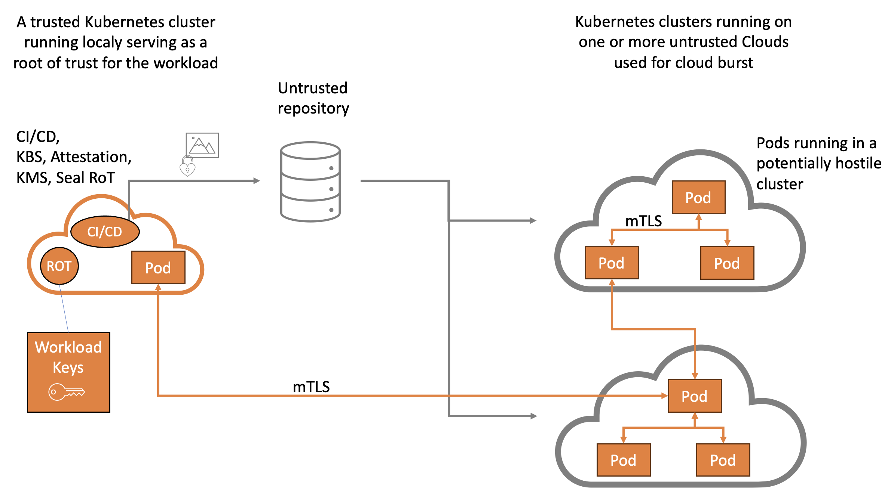
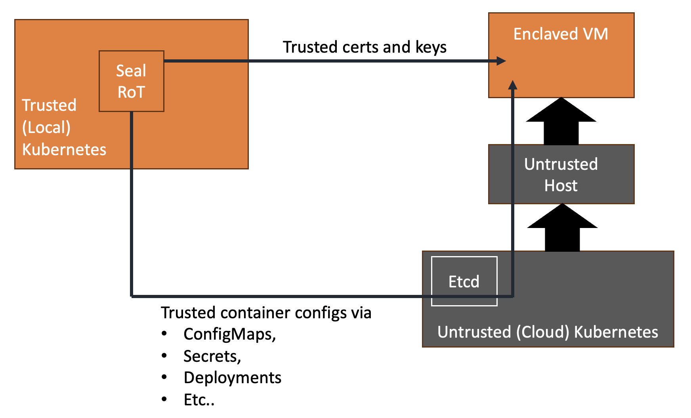

Seal is WIP and includes on going security research and evaluation. Comments made here regarding [Confidential Containers](https://github.com/confidential-containers) require additional review.

# Seal
Seal is a deployment model and a POC that adds on top of [Confidential Containers](https://github.com/confidential-containers) to construct the necessery tooling and modelling for cloud bursting of workloads which process sensitive data. Seal utilizes a local Root-Of-Trust (RoT) Kubernetes cluster and allow burting into untrusted remote kubernetes clusters. The RoT cluster is typically deloyed locally by an organization using trusted hardware in a trsuted environment which is entirely under control of the trusting team. The remote untrusted clusters are typically managed by various cloud providers. Seal strickly considers anyone with remote cloud provider admin priviliges as a potential offender. This means that anything outside of the enclave is untrusted and any communication with such untrusted entity requires proper security controls. Seal adds security controls where controls are missing by [Confidential Containers](https://github.com/confidential-containers). Additionaly Seal considers the entire workload end to end including any information shared between enclaves and/or between an envlave and the trusted local RoT cluster.

Seal-Control offers:
- Protectinbg the remote pod enclaves from an offensive remote Kubernetes cluster
- Establishing a dedicated certificate authority per workload and distributing the certificates to enbale cross pod mTLS comunication
- Offering control over remote pod configuration and concealing such configuration from the remote untrusted kubernetes systems.

The approach taken by Seal is that ANY information entering or leaving the enclave should be controled by the enclave. ANY information entering or leaving the RoT cluster should be controled by the RoT cluster.

Additionaly, any data including configurational data that may leak sensitive information or be used by an offender to advance an attack vector against the workload, should be encrypted prior to leaving the enclave (or RoT) boundary. The decryption keys for such encrypted information should be maintained inside the enclaves (or RoT) and nowhere else. An exception of this rule is any other system the data owner permits (such as the data owner own systems).  

## Kubernetes user managed resources 
Under Kubernetes, workload configuration is done using various Kubernetes resources such as ConfigMaps, Secrets, CRDs, etc. Other configuration is done within the PodSpec, for example, env variables, command arguments, volume mounts etc. Since Seal considers the remote cloud kubernetes clusters as untrusted, it needs to ensure that any such configurational information will be delivered to the containers running inside the enclave unchanged. In some cases, it also needs to ensure that such configuration will remain concealed. Seal demonsrates such a mechanism by encrypting configurational information in the trusted environment with a worklaod AES key. Once the information decrypted inside the enclave, it can be used to interpert the intentions of the cloud users and comapre them to the configuration received from the untrusted host on the cloud side. This allows both scruteny of configurational information and concelment of such information when applicable. 

[Confidential Containers](https://github.com/confidential-containers) offers supportf for `sealed secrets` which can in the future be extended to handle additional resources as demonstrated by Seal.

## Kubernetes system managed information 
Under Kubernetes, some fo the information used by containers is sourced from the kubernetes system, this includes for example the `hostname`, `/etc/hosts`, `/etc/resolv.conf`, the `serviceaccount` secrets etc.  Since Seal considers the remote cloud kubernetes clusters as untrusted, it needs to verify that the supplied kubernetes information will not be harmful to the containers inside the enclave. Seal demonstrates verification of Kuberneets system managed information inside the enclave. 

## Container image and mount points
Special care should be given to conrolling the mountpoints to ensure an offensive cloud provider will not be able to manipulate the mountpoints to run arbitrary code or unplanned code at a conatiner running inside the enclave. Presently, [Confidential Containers](https://github.com/confidential-containers) seem to luck the necessery controls. The OPA effort of [Confidential Containers](https://github.com/confidential-containers) may offer some remedy to some of the required controls. Seal demonstrates using the information embedded in Kubernetes resoucres to identify legitimate mounts points from illegitimate ones. It also demonstrates how we may limit mount points to avoid their use as attack vectors.

## Container cmd and cwd
Special care should be given to conrolling the cmd and cwd to ensure an offensive cloud provider will not be able to manipulate them to run arbitrary code or unplanned code at a conatiner running inside the enclave. Presently, [Confidential Containers](https://github.com/confidential-containers) seem to luck the necessery controls. The OPA effort of [Confidential Containers](https://github.com/confidential-containers) is expected to offer a remedy to the required controls under certain circumstances. However to offer such remedy, the policy fed to the OPA should be provided with information about the legitimate CMD and CWD. Seal demonstrate alternative solution that can be combined with a fixed OPA policy. 

# Deployment Model
Seal uses the resources of local trusted cluster to manage cloud burst to remote untrusted clusters. The RoT cluster includes:
 - KBS, Attestation and other CoCo central services
 - CI/CD for the crteation and encryption of container images used in remote clusters
 - Seal RoT for the delivery of Certificates and workload keys (or a paralel alternative)

 The images deployed on the remote untrusted clusters should be prepared and encrypted at a CI/CD running on the local cluster. Such images will inclue an `Seal Egg`` that will be used by the pods running remotely to authenticate themself against the Seal RoT and obtain the necessery keys for their workload. Such keys inlcude both mTLS keys and data encryption/dectryption keys. 

All workload pods should be designed to ensure that sensitive data is comunicated only via the provided mTLS credentials with peers of the same workload (I.e. peers using their own provided mTLS credentials of the same Workload CA). Alternatively a workload pod may send/receive cypher data to anywhere outside the workload using the provided data encryption/dectryption keys. For example cy-her data may be sent as a Kafka Message, stored in Object Store etc. The only limtation is for such data to be encrypted/decrypted inside the enclave.

The key used for decrypting the image in remote clusters should be obtained through CoCo attenstation. The attstation service should also run on the local RoT cluster. The CI/CD should obtain the Egg from the Seal RoT, embed it in the image and than encrypt it with the appropriate key from the CoCo Keyprovider.

## Certificates
Seal manages certificate athorities (CAs) and certificates used for mTLS. It manages a Seal wide CA used for communicating with the Seal ROT. Further, it manages a per Workload CA. 

## Seal Egg
A Seal Egg is a data structure embedded during image creation inside the encrypted container image. 
Future versions may deliver the Seal Egg via CoCo after attestation. 
The Egg includes an initial certificate which is used to communicate with the Seal RoT. The container then sends the Seal RoT a cypher which is embeded in the Egg. The cypher help identify the specifics of a workload image including the workload name and a peer name. The default peer name is "any". Any pod created with the image obtains an adhoc certificate signed by the workload CA and carrying the peer name.

## mTLS between pods on the same cluster
Pod certificates are used both for client and for server side udner mTLS. Clients and Servers verify that the peer is signed with the Worklaod CA and carry the the SAN "any". Optionaly, Clients and Servers may also verify specific peer names. 

## mTLS between pods on different clusters 
For m2m communication patterns across cloud bounderies, set the Kubernetes services to use L4 ingress or load balancer (for example you may use Openshift passthrough Routes) to allow end-to-end mTLS communication. 

External clients runing on a trusted cluster should use mTLS to communicate with the pods on remote untrusted clusters by obtaining certificates signed by the workload CA from the ROT. The same is true for a client from one cluster (or cloud) communicting with server on another cluster (or cloud). To facilitate standard mTLS verification, Seal supports adding the server hostname to the server certificate using the `HOSTNAMES` env variable.

## Https or HTTP between a standard external client and the workload pods
For use cases where standard external clients (such as browsers) need to communicate with the workload, all standard communication patterns are supported. It is up to the workload owner to consider the security implications of any data sent to, or received from, such cleints.   

In case https is required, standard methodologies should be applied for signing the server certificate with public CAs. Where client side authentication is also required, standard mechanisms can be applied. 

